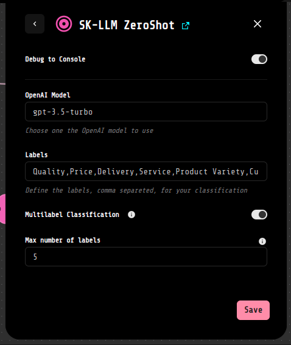
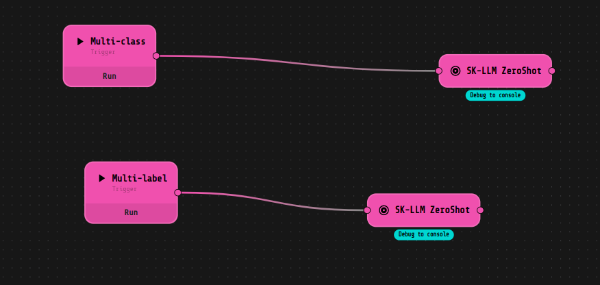

# scikit-llm_extension
LOKO AI extension to use [Scikit-llm python library](https://github.com/iryna-kondr/scikit-llm)


Scikit-llm_extension for LOKO AI allows through the usage of the component _SK-LLM ZeroShot_ to perform multilingual text classification without any previous training. It allows to set the output labels directly from the block configuration. It's also possible to choose which OpenAI Model to use and whether you want to have MultiLabel classification or a classic Multi-Class.




**Example**:

You can pass a list of strings to the component and it will return a list of dictionaries with the labels, the scores and the original sequence. 

In the example below we are using the model GPT3.5-turbo to classify the sentences in the list. The labels set in the block configuration are:
positive,negative,neutral

Input: 
```
["I was absolutely blown away by the performances in 'Summer's End'. The acting was top-notch, and the plot had me gripped from start to finish. A truly captivating cinematic experience that I would highly recommend.",
 "The special effects in 'Star Battles: Nebula Conflict' were out of this world. I felt like I was actually in space. The storyline was incredibly engaging and left me wanting more. Excellent film."]

```

Output:
```
{"I was absolutely blown away by the performances in 'Summer's End'. The acting was top-notch, and the plot had me gripped from start to finish. A truly captivating cinematic experience that I would highly recommend.":"positive",
"The special effects in 'Star Battles: Nebula Conflict' were out of this world. I felt like I was actually in space. The storyline was incredibly engaging and left me wanting more. Excellent film.":"positive"}
```


## EXAMPLE FLOW



## Configuration

In the file *config.json* you can set the **Hugging Face model**
(you can find the available models <a href="https://huggingface.co/models?pipeline_tag=zero-shot-classification&sort=downloads">here</a>), your **Hugging Face token** and where to mount your 
**Hugging Face volume** (all the downloaded models will be saved in this directory):

```
{
  "main": {
    "environment": {
      "HF_TOKEN": "<insert your HF token here>",
      "HF_MODEL": "joeddav/xlm-roberta-large-xnli"
    },
      "volumes": [
        "/var/opt/huggingface:/root/.cache/huggingface"
      ]
    }
}
```
**Note:** you can drop the **HF_TOKEN** variable if your model does not require authentication, otherwise you have to 
<a href="https://huggingface.co/join">sign up</a> and create your Access Token.  